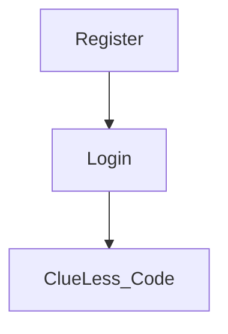
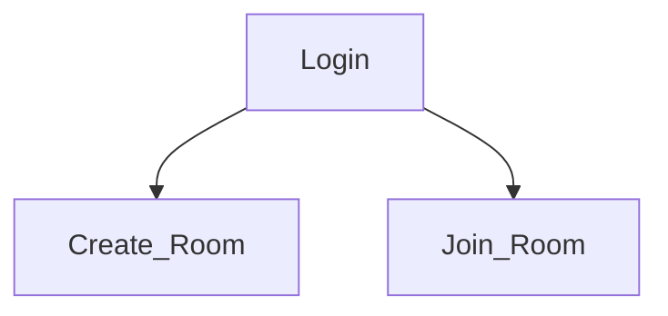

# Clue-Less

```text
   ______ __                     __                    
  / ____// /__  __ ___          / /   ___   _____ _____
 / /    / // / / // _ \ ______ / /   / _ \ / ___// ___/
/ /___ / // /_/ //  __//_____// /___/  __/(__  )(__  ) 
\____//_/ \__,_/ \___/       /_____/\___//____//____/  
```

This project is using the fastapi framework in addition to click for providing an clue-less game that can be played
in the terminal and on your browser.

## Project Structure

`clueless` is our project root

`pyproject.toml` defines our project's requirements.

`clueless/main.py` defines the entry points for the application, namely:
- The terminal entry point `clue play`
- The web serving command `clue serve`

`clueless/app` contains all the application logic including
- The fastapi webapp definitions
- Web app logic including UI/UX
- Core logic

`clueless/app/core` contains all the core game logic such as
- Game Loop
- Characters
- Players
- Rooms

## Getting Started

Make sure you have at least python 3.9 installed.

```bash
python --version
```

Make a virtual environment

```bash
python -m venv venv
. ./venv/bin/activate
```

Install dependencies
```bash
pip install .
```

### Alternative Setup (Later in Project)

When we get to deploying the stack we may want to use docker.

To build and stand up the stack following the steps. (Must have docker and docker compose installed).

```bash
docker compose build
```

Standup
```bash
docker compose up
```

## Playing the game

### Terminal
Run the following command
```bash
clue play
```

### On your browser

```bash
clue serve
```

Alternatively, you can use docker

```bash
docker compose up --build
```

## Instructions

### Authentication

The Clue-less stack now uses a user authentication system via `fastapi-users`.
Generally users will need to register and login. The frontend will need to keep
 the session information when logged in. The general process for testing this is:

1. Stand up the stack with the prior instructions.
2. Visit the docs page at http://0.0.0.0:80/docs
3. Register for a new account at http://0.0.0.0/docs#/auth/register_register_api_auth_register_post
   1. Provide a username (email) and password)
4. Log in to the docs by clicking on the authorization button at the top of the page.
   1. Provide your username and password. You don't need to provide anything else.
5. You are now authenticated and logged in to the docs, you can test the endpoints now.



### Rooms

Games are centered around game rooms. They're basically a lobby for you to wait in before your game starts.

#### Creating a room

1. Stand up the stack with the prior instructions.
2. Visit the docs page at http://0.0.0.0:80/docs
3. Log in to the docs by clicking on the authorization button at the top of the page.
   1. Provide your username and password. You don't need to provide anything else.
4. Visit the create room doc. http://0.0.0.0/docs#/room/create_room_api_room__post
   1. Click Try it out
   2. Create a room with the payload of: and send

```json
{
  "name": "My Game"
}
```

5. You will receive the response


```json
{
  "name": "My Game",
  "player_limit": 6,
  "is_started": false,
  "host": "f4b8215d-5e3d-4444-9228-e0e5da5fad09",
  "id": "a943d563-828b-414e-98a5-dd37828770dd",
  "room_key": "pVn6",
  "users": [
    "f4b8215d-5e3d-4444-9228-e0e5da5fad09"
  ]
}
```

6. Visit the rooms UI page to see your room. http://0.0.0.0/rooms

